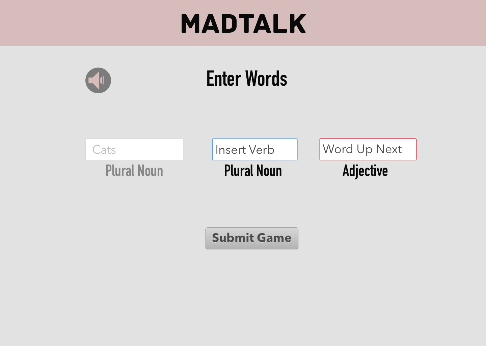

# MadTalk
[Deployed Site](https://madtalk.herokuapp.com/)

MadTalk is a fun take on MadLibs: the app prompts the user to provide whimsical words that replace words in a text snippet. The text snippets are drawn from saucy romance novel synopses. The app uses the browser's speech recognition interface (supported by chrome) which allows the user to input the  words by speaking. The app then reads the completed game.

MadTalk uses this backend to serve up the app's text snippets and word types: [Words Backend](https://github.com/lauraturk/lt-byob)

## Technology
* React.js
* Speech recognition
* Router
* PostgreSQL database
* Node.js server wrapped in express
* Knex
* Deployed to Heroku

## Installation and Setup
* clone repo
* npm install
* npm start

## Resources
Starter repo: [starter](https://github.com/facebookincubator/create-react-app)

## Reflection
Our group built this app as part of a Turing capstone project over the course of 1 1/2 weeks. Our group includes three members: Laura, Anders and Chris.

## Screenshots
#### Demonstration:

#### User Inputting Words:

#### Game Output:

## Wireframes
* 
* 
* 
